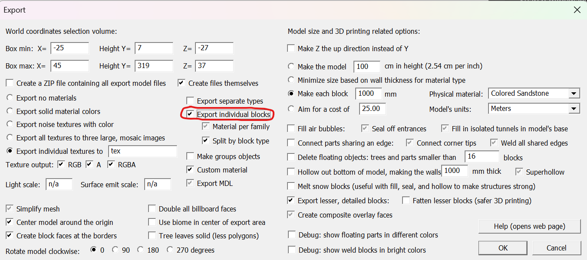

# Mineways-RTX-Raytracer

A simple hardware-raytracer for Minecraft scenes exported with [Mineways](https://www.realtimerendering.com/erich/minecraft/public/mineways/). The renderer uses AABBs for all "normal" blocks and Triangles otherwise. Default Minecraft textures, as well as Physically based material are supported. 

While exporting with [Mineways](https://www.realtimerendering.com/erich/minecraft/public/mineways/) check the "Export individual blocks" checkbox for expected results:

Place the exported `.obj`, `.mtl`, and the texture folder into the `MinecraftModels` directory to ensure the renderer can locate the model.

## Requirements

* Windows or Linux (x64 or ARM64)
* CMake 3.10
* A C++ 17 compiler (Visual Studio 2019, GCC 8 or Clang 6)
* A shader compiler (DXC for DX12, DXC-SPIR-V for Vulkan - the newer the better)
* Hardware Raytracing capable graphics card (E.g NVIDIA RTX)

## Build

1. Clone the repository **with all submodules**:
   
   `git clone --recursive github.com/SirKero/Mineways-RTX-Raytracer.git`
   
2. Use CMake to build.

